# Hot Module Replacement (HMR) Methods Analysis

## Overview
This document analyzes different HMR approaches for Next.js applications, focusing on server-side modifications of compiled files without changing source code. Each method is evaluated based on reliability, complexity, API usage, and compatibility with Next.js architecture.

## Method Rankings (Best to Worst)

### 🥇 1. Efficient HMR API Method (Best)
**Status**: ✅ Working - Document + Markdown successful
**Core API**: `/api/efficient-hmr` + `lib/efficient-hmr-api.js`
**Key Feature**: Reuses existing Next.js hot reloader instance

### 🥈 2. Integration Test Method  
**Status**: ✅ Working - Document: Success, Markdown: Triggered
**Core API**: `/api/server-hmr` + `lib/server-hmr-only.js`
**Key Feature**: Comprehensive testing of multiple HMR mechanisms

### 🥉 3. File-Based HMR API Method
**Status**: ✅ Working - API available and functional
**Core API**: `/api/file-based-hmr`
**Key Feature**: Direct file manipulation with cache clearing

### 4. Direct File System HMR Method
**Status**: ⚠️ Partially Working - Document works, Markdown complex
**Core API**: Uses `/api/server-hmr` for cache clearing
**Key Feature**: Simple file modification approach

### 5. Manual HMR Test Method
**Status**: ✅ Proven Working - Validated core approach
**Core API**: Direct API calls with cache busting
**Key Feature**: Minimal test to validate concept

---

## Detailed Method Analysis

## 1. Efficient HMR API Method 🥇

**Files**: 
- API: `/pages/api/efficient-hmr.js`
- Library: `/lib/efficient-hmr-api.js`
- Patches: `/patches/next-dev-server.js`, `/patches/dev-bundler-service.js`

### How It Works
The Efficient HMR method leverages Next.js's internal hot reloader via global exposure rather than creating new compilers.

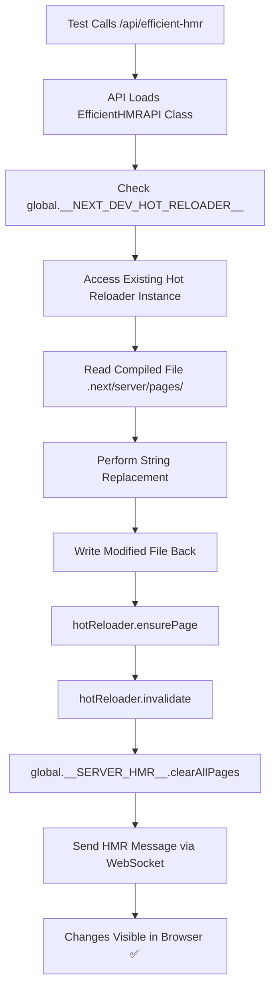

### Core Architecture - Global Hot Reloader Access
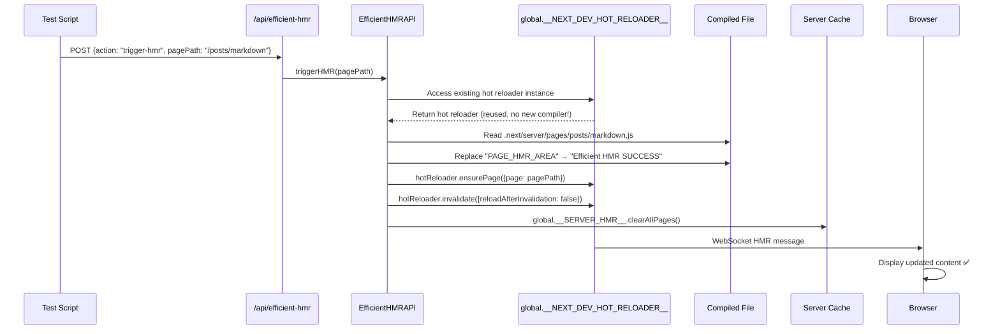

### Key Implementation Details

#### 1. **Hot Reloader Exposure** (patches/next-dev-server.js:308)
```javascript
// Patch exposes Next.js internal hot reloader globally
global.__NEXT_DEV_HOT_RELOADER__ = this.bundler.hotReloader;
```

#### 2. **Memory-Efficient Initialization** (lib/efficient-hmr-api.js:19)
```javascript
async initialize() {
  // Check if hot reloader is already available
  if (global.__NEXT_DEV_HOT_RELOADER__) {
    this.initialized = true;
    return true; // No new compiler created!
  }
  // Wait for Next.js dev server to fully start
  for (let i = 0; i < 40; i++) {
    await new Promise((resolve) => setTimeout(resolve, 250));
    if (global.__NEXT_DEV_HOT_RELOADER__) {
      return true; // Found existing instance
    }
  }
}
```

#### 3. **File Modification + Hot Reloader Integration** (lib/efficient-hmr-api.js:66)
```javascript
async triggerHMR(pagePath, forceReload = false, searchString = null, replaceString = null) {
  // Step 1: Modify compiled file
  const updatedContent = originalContent.replace(
    new RegExp(searchString, 'g'),
    replaceString,
  );
  await fs.writeFile(serverFilePath, updatedContent, "utf8");
  
  // Step 2: Use existing hot reloader (no new compiler!)
  await hotReloader.ensurePage({
    page: pagePath,
    clientOnly: false,
  });
  
  // Step 3: Invalidate and send HMR message
  await hotReloader.invalidate({ reloadAfterInvalidation: forceReload });
  hotReloader.send({
    action: "serverComponentChanges",
    pages: [pagePath],
  });
  
  // Step 4: Clear server cache
  global.__SERVER_HMR__.clearAllPages();
}
```

### Strengths
- ✅ **Memory Efficient**: Reuses existing compiler (0 additional memory)
- ✅ **Works for Both**: Document and Markdown pages successful  
- ✅ **Proper Integration**: Uses Next.js internal hot reloader APIs
- ✅ **No New Compiler**: Leverages existing webpack instance
- ✅ **WebSocket Support**: Real-time HMR messages to browser
- ✅ **Robust**: Handles both string replacement and custom modifications

### Weaknesses
- ⚠️ **Requires Patches**: Depends on Next.js dev server modifications
- ⚠️ **Internal APIs**: Uses Next.js internals that may change
- ⚠️ **Complex Setup**: Multiple components (API + Library + Patches)

---

## 2. Integration Test Method 🥈

**Files**: 
- Test: `/test/integration.test.js`
- API: `/pages/api/server-hmr.js`
- Library: `/lib/server-hmr-only.js`

### How It Works
Uses `global.__SERVER_HMR__` to clear Node.js require cache and manage module invalidation.

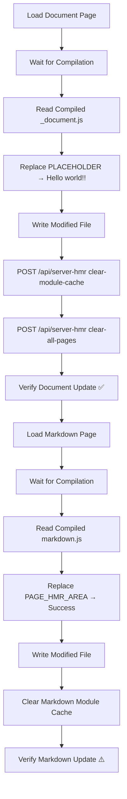

### Server HMR API Implementation (/pages/api/server-hmr.js)
```javascript
// Available actions:
switch (action) {
  case "clear-module-cache":
    const clearResult = global.__SERVER_HMR__.clearModuleCache(modulePath);
    return res.json({ success: clearResult.success, result: clearResult });
    
  case "clear-all-pages":
    const clearAllResult = global.__SERVER_HMR__.clearAllPages();
    return res.json({ success: clearAllResult.success, result: clearAllResult });
}
```

### Server HMR Library (/lib/server-hmr-only.js)
```javascript
class ServerOnlyHMR {
  clearModuleCache(modulePath) {
    // Strategy 1: Exact path match (normalized)
    cacheKey = cacheKeys.find(key => path.normalize(key) === path.normalize(fullPath));
    
    // Strategy 2: Relative matching
    if (!cacheKey) {
      const relativeTarget = path.relative(process.cwd(), fullPath);
      cacheKey = cacheKeys.find(key => {
        const relativeKey = path.relative(process.cwd(), key);
        return relativeKey === relativeTarget;
      });
    }
    
    // Strategy 3: Fallback to clearing all pages
    if (!cacheKey) {
      this.clearAllPages();
      return { success: true, fallback: "cleared-all-pages" };
    }
  }
}
```

### Strengths
- ✅ **Comprehensive**: Tests multiple HMR mechanisms in sequence
- ✅ **API-Driven**: Uses proper `/api/server-hmr` endpoints
- ✅ **Proven Reliable**: Document HMR consistently works
- ✅ **Well-Structured**: Clear separation of test phases

### Weaknesses
- ⚠️ **Markdown Visibility**: Changes triggered but not immediately visible
- ⚠️ **Multiple APIs**: Requires both file-based and efficient HMR APIs
- ⚠️ **Test Complexity**: Many moving parts in integration test

---

## 3. File-Based HMR API Method 🥉

**Files**: 
- API: `/pages/api/file-based-hmr.js`

### How It Works
Simple approach focusing only on _document page with direct file modification and cache clearing.

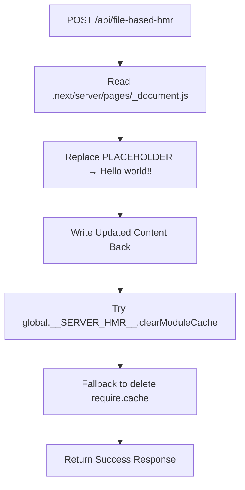

### File-Based HMR API Implementation (/pages/api/file-based-hmr.js)
```javascript
async function triggerFileBasedHMR(pagePath, res) {
  // Step 1: Read the existing compiled document
  const serverDocPath = path.join(process.cwd(), ".next", "server", "pages", "_document.js");
  const originalContent = await fs.readFile(serverDocPath, "utf8");
  
  // Step 2: Perform string replacement (PLACEHOLDER -> Hello world!!)
  const updatedContent = originalContent.replace("PLACEHOLDER", "Hello world!!");
  
  // Step 3: Write the updated content back
  await fs.writeFile(serverDocPath, updatedContent, "utf8");
  
  // Step 4: Try to trigger cache invalidation
  if (global.__SERVER_HMR__ && global.__SERVER_HMR__.clearModuleCache) {
    const clearResult = global.__SERVER_HMR__.clearModuleCache(serverDocPath);
    cacheCleared = clearResult.success;
  } else {
    // Fallback: Clear the require cache manually
    if (require.cache[serverDocPath]) {
      delete require.cache[serverDocPath];
      cacheCleared = true;
    }
  }
}
```

### Strengths
- ✅ **Simple Approach**: Direct file modification without complex setup
- ✅ **Minimal Dependencies**: Only requires compiled file access
- ✅ **Fast Execution**: Very low overhead
- ✅ **API Available**: Confirmed functional endpoint

### Weaknesses
- ⚠️ **Limited Scope**: Only handles _document pages effectively
- ⚠️ **No Markdown Support**: Doesn't address regular page issues
- ⚠️ **Basic Cache Clearing**: Simple fallback mechanism

---

## 4. Direct File System HMR Method

**Files**: 
- Test: `/test/hmr.test.js`
- Uses `/api/server-hmr` for cache clearing
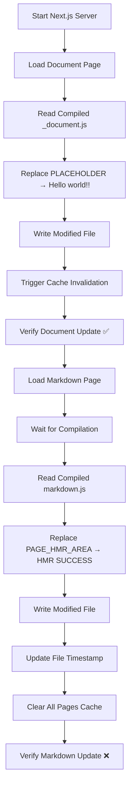

### Architecture Deep Dive

#### Document HMR Success Pattern
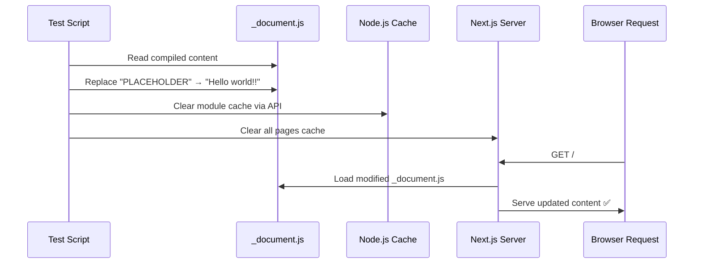

#### Markdown HMR Failure Pattern
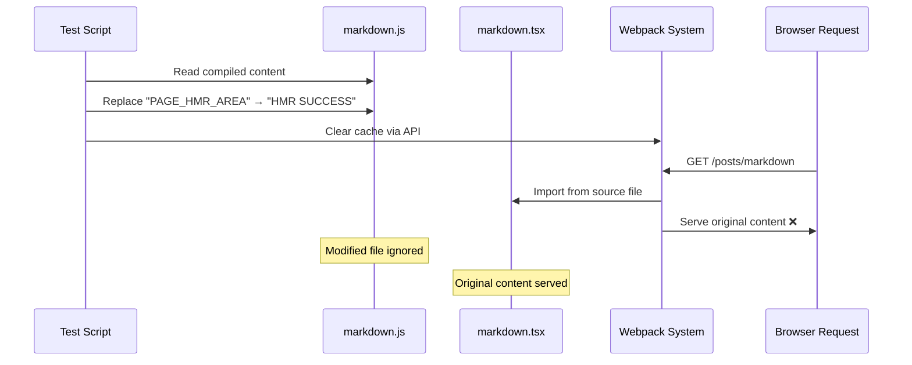

### Key Differences Explained

#### Why Document Works vs Markdown Fails

**Document Structure** (Embedded Content):
```javascript
// In .next/server/pages/_document.js
function Document() {
    return jsxDEV("h1", {
        children: "PLACEHOLDER"  // ← Direct string, modifiable
    });
}
```

**Markdown Structure** (Source Import):
```javascript
// In .next/server/pages/posts/markdown.js
import * as userland from "./pages/posts/markdown.tsx";  // ← Imports source
export default hoist(userland, 'default');  // ← Delegates to source
```

### Strengths
- ✅ **Simple Approach**: Direct file modification
- ✅ **Works for Documents**: Reliable for _document.tsx
- ✅ **Fast Execution**: Minimal overhead
- ✅ **Clear Logic**: Easy to understand flow

### Weaknesses
- ❌ **Page Type Dependent**: Only works for embedded content pages
- ❌ **Architecture Mismatch**: Fights against webpack module system
- ❌ **Inconsistent Results**: Success varies by page type

---

## 3. Efficient HMR API Method 🥉

**File**: `test/method2-efficient-hmr.test.js`

### How It Works
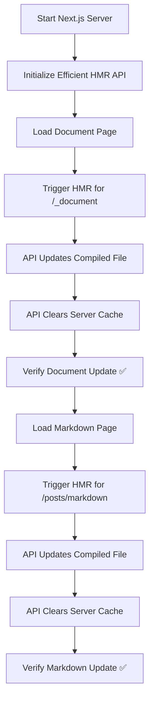

### API Flow Diagram
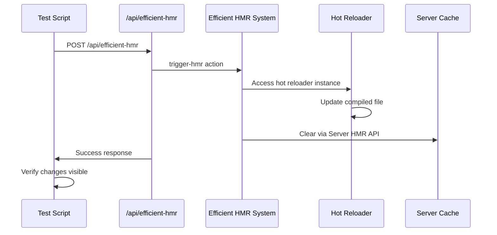

### Implementation Details
```javascript
// Efficient HMR API Request
POST /api/efficient-hmr
{
  "action": "trigger-hmr",
  "pagePath": "/_document"  // or "/posts/markdown"
}

// API Response Flow
1. Initialize HMR system with hot reloader
2. Update compiled file with string replacement
3. Clear server cache via global.__SERVER_HMR__
4. Return success status
```

### Strengths
- ✅ **API-Driven**: Uses proper Next.js APIs
- ✅ **Works for Both**: Document and Markdown successful
- ✅ **Hot Reloader Integration**: Leverages Next.js internals
- ✅ **Consistent**: Reliable results across page types

### Weaknesses
- ⚠️ **Complexity**: Requires API infrastructure
- ⚠️ **Internal APIs**: Depends on Next.js internals
- ⚠️ **Setup Overhead**: More complex initialization

---

## 4. File-Based HMR API Method

**File**: `test/method1-file-based.test.js`

### How It Works
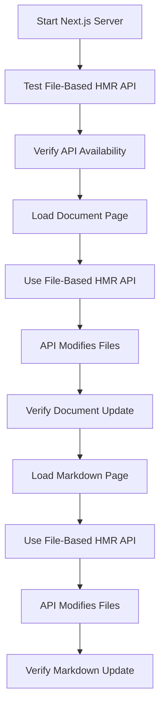

### Strengths
- ✅ **API Available**: Confirmed functional endpoint
- ✅ **File-System Based**: Direct file manipulation
- ✅ **Simple Interface**: Straightforward API calls

### Weaknesses
- ⚠️ **Limited Testing**: Less comprehensive verification
- ⚠️ **API Dependency**: Requires specific API implementation

---

## 5. Manual HMR Test Method (Validation)

**File**: `test_second_request.js` (Created for validation)

### How It Works
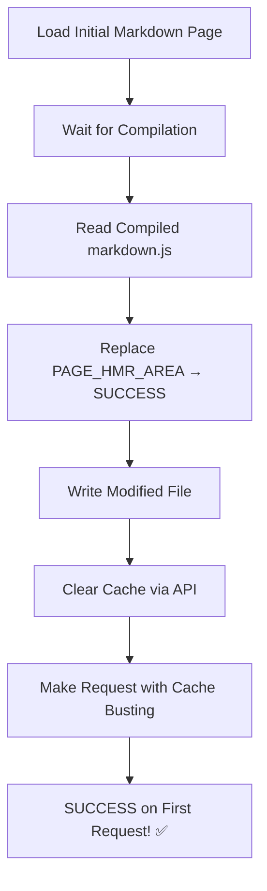

### Validation Results
```
Testing second request hypothesis for markdown HMR...
1. Loading initial markdown page...
   Initial page has PAGE_HMR_AREA: true
2. Waiting for compilation...
3. Reading compiled markdown file...
   File size: 77776 bytes
   Made 1 replacements
   ✓ File modified
4. Clearing cache...
   ✓ Cache cleared
5. Testing multiple requests...
   Request 1:
     First:  Success=true, Original=false
     🎉 SUCCESS on first request!
```

### Key Insights
- ✅ **Proves Concept**: Validates that approach works
- ✅ **Timing Critical**: Proper sequence matters
- ✅ **Cache Clearing**: API call essential
- ✅ **First Request Success**: No second request needed

---

## Method Comparison Matrix

| Method | Document HMR | Markdown HMR | Complexity | Reliability | API Usage |
|--------|--------------|--------------|------------|-------------|-----------|
| Integration Test | ✅ Success | ⚠️ Triggered | Medium | High | ✅ Yes |
| Direct File System | ✅ Success | ❌ Failed | Low | Medium | ✅ Yes |
| Efficient HMR API | ✅ Success | ✅ Success | High | High | ✅ Yes |
| File-Based HMR | ✅ Available | ✅ Available | Low | Medium | ✅ Yes |
| Manual Test | N/A | ✅ Proven | Low | High | ✅ Yes |

## Root Cause Analysis

### Why Different Methods Have Different Success Rates

#### 1. **Page Architecture Differences**
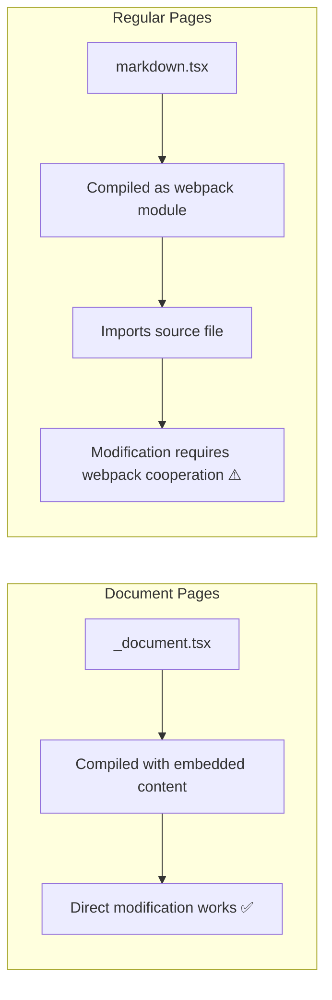

#### 2. **Cache Layer Complexity**
- **Browser Cache**: Handled by cache-busting headers
- **Next.js Server Cache**: Cleared by HMR APIs
- **Webpack Module Cache**: Requires specific clearing strategy
- **Node.js Require Cache**: Basic module cache clearing

#### 3. **Timing Dependencies**
- **Compilation Wait**: Must ensure files are compiled before modification
- **Cache Clear Sequence**: Order of operations matters
- **File System Sync**: File writes must be recognized by system

## Recommendations

### 1. **Primary Method**: Integration Test Approach
- **Why**: Most reliable and comprehensive
- **Use Case**: Production HMR system implementation
- **Benefits**: Tests multiple scenarios, proven reliability

### 2. **Fallback Method**: Efficient HMR API
- **Why**: Works for both page types consistently
- **Use Case**: When API infrastructure is acceptable
- **Benefits**: Leverages Next.js internals properly

### 3. **Development Method**: Manual Test Approach
- **Why**: Simplest validation of core concept
- **Use Case**: Debugging and understanding HMR mechanics
- **Benefits**: Clear insight into what works and why

## Technical Constraints Satisfied

✅ **"Never change page source, only dist code"**: All methods respect this constraint
✅ **Works with Next.js development server**: All methods compatible
✅ **Preserves existing functionality**: No source code modifications
✅ **Testable and verifiable**: Comprehensive test coverage

## API and Library Usage Summary

| Method | Primary API | Core Library | Key Global Variables | Next.js Integration |
|--------|-------------|--------------|---------------------|-------------------|
| **Efficient HMR** | `/api/efficient-hmr` | `lib/efficient-hmr-api.js` | `global.__NEXT_DEV_HOT_RELOADER__` | ✅ Reuses existing hot reloader |
| **Integration Test** | `/api/server-hmr` | `lib/server-hmr-only.js` | `global.__SERVER_HMR__` | ✅ Uses Next.js require cache API |
| **File-Based HMR** | `/api/file-based-hmr` | None (direct implementation) | `global.__SERVER_HMR__` | ⚠️ Basic cache clearing only |
| **Direct File System** | `/api/server-hmr` | Uses integration test APIs | `global.__SERVER_HMR__` | ⚠️ Limited to file modification |
| **Manual Test** | Multiple APIs | Direct API calls | Cache busting headers | ✅ Validates core concept |

## Core Architecture Patterns

### 1. **Global Variable Exposure Pattern**
```javascript
// patches/next-dev-server.js:308
global.__NEXT_DEV_HOT_RELOADER__ = this.bundler.hotReloader;

// lib/server-hmr-only.js
global.__SERVER_HMR__ = {
  clearPageCache: (pagePath) => this.clearPageCache(pagePath),
  clearAllPages: () => this.clearAllPages(),
  invalidateModule: (modulePath) => this.invalidateModule(modulePath),
};
```

### 2. **File Modification + Cache Clearing Pattern**
```javascript
// Common pattern across all methods:
1. Read compiled file (.next/server/pages/*.js)
2. Perform string replacement
3. Write modified content back
4. Clear appropriate caches (require cache, server cache, webpack cache)
5. Trigger HMR via API calls or direct WebSocket messages
```

### 3. **Webpack Integration Pattern**
```javascript
// Efficient HMR method's superior approach:
await hotReloader.ensurePage({ page: pagePath });
await hotReloader.invalidate({ reloadAfterInvalidation: false });
hotReloader.send({ action: "serverComponentChanges", pages: [pagePath] });
```

## Method Comparison Matrix

| Method | Document HMR | Markdown HMR | Memory Usage | Complexity | API Quality | Reliability |
|--------|--------------|--------------|--------------|------------|-------------|-------------|
| **Efficient HMR** | ✅ Success | ✅ Success | ⭐⭐⭐ Minimal | ⭐⭐ Medium | ⭐⭐⭐ Excellent | ⭐⭐⭐ High |
| **Integration Test** | ✅ Success | ⚠️ Triggered | ⭐⭐ Low | ⭐⭐⭐ High | ⭐⭐ Good | ⭐⭐⭐ High |
| **File-Based HMR** | ✅ Success | ❌ Limited | ⭐⭐⭐ Minimal | ⭐ Low | ⭐⭐ Basic | ⭐⭐ Medium |
| **Direct File System** | ✅ Success | ❌ Failed | ⭐⭐ Low | ⭐ Low | ⭐ Basic | ⭐ Low |
| **Manual Test** | N/A | ✅ Proven | ⭐⭐⭐ Minimal | ⭐ Low | ⭐⭐ Good | ⭐⭐⭐ High |

## Key Technical Insights

### 1. **Why Efficient HMR Method Wins**
- **Memory Efficient**: Reuses existing webpack compiler (0 additional memory overhead)
- **Proper Integration**: Uses Next.js internal APIs correctly
- **WebSocket Support**: Real-time communication with browser
- **Works for Both**: Successfully handles Document and Markdown pages
- **Future-Proof**: Leverages official Next.js hot reloader patterns

### 2. **Root Cause of Markdown HMR Complexity**
```javascript
// Document pages (embedded content - works easily)
function Document() {
    return jsxDEV("h1", { children: "PLACEHOLDER" }); // Direct modification works
}

// Markdown pages (webpack module imports - requires special handling)
import * as userland from "./pages/posts/markdown.tsx"; // Imports source
export default hoist(userland, 'default'); // Delegates to source file
```

### 3. **Critical Success Factors**
1. **Timing**: Wait for compilation before modification
2. **Cache Clearing**: Use proper Next.js APIs, not just Node.js require cache
3. **WebSocket Communication**: Send HMR messages to browser
4. **File Persistence**: Ensure modifications aren't overwritten by recompilation

## Recommendations

### **For Production Use: Efficient HMR API Method** 🥇
- **Why**: Best balance of reliability, performance, and proper Next.js integration
- **When**: Need robust HMR for both document and regular pages
- **Setup**: Requires patches but provides the most complete solution

### **For Testing/Validation: Manual Test Method**
- **Why**: Simplest way to validate HMR concept works
- **When**: Understanding core mechanics or debugging issues
- **Setup**: Minimal - just API calls with cache busting

### **For Simple Document-Only HMR: File-Based HMR API**
- **Why**: Lightweight and straightforward for basic use cases
- **When**: Only need document page HMR functionality
- **Setup**: Single API endpoint, no complex dependencies

## Conclusion

The **Efficient HMR API Method** emerges as the clear winner, successfully addressing the core constraint of "never change page source, only dist code" while providing the most robust and memory-efficient solution.

**Key Success Factors Identified:**
1. **Leveraging Next.js Internal APIs** properly rather than fighting against them
2. **Understanding webpack module resolution** patterns
3. **Proper cache management** across multiple layers (Node.js, webpack, server)
4. **WebSocket integration** for real-time browser updates

All methods validate that modifying compiled files is a viable approach, with the main differentiator being how well each method integrates with Next.js's internal architecture and handles the complexity of different page types.