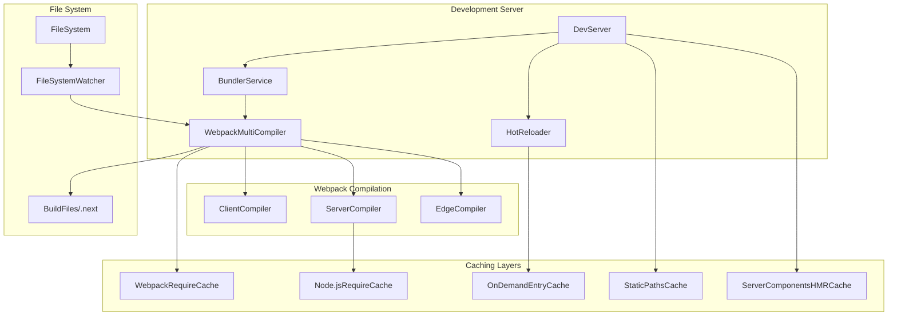
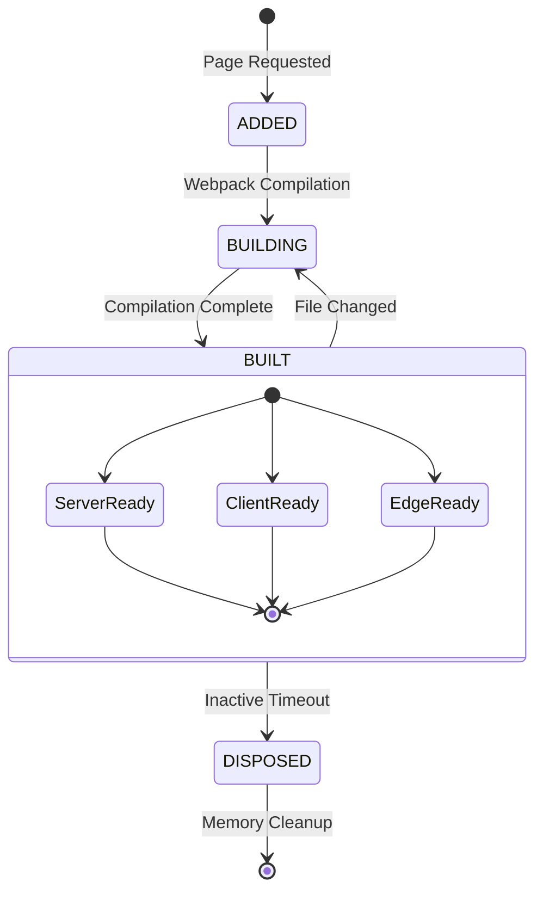
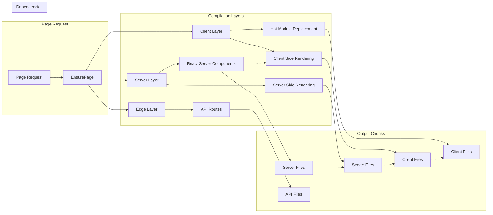
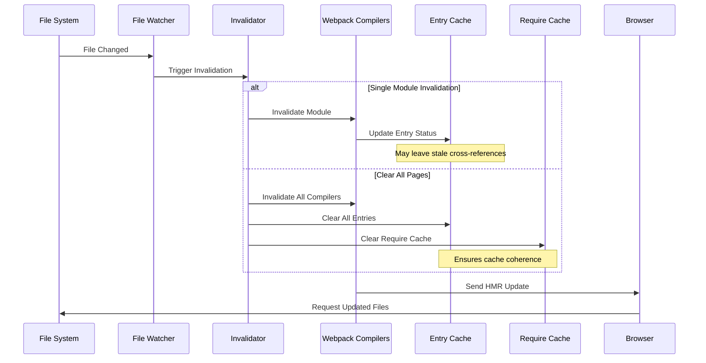
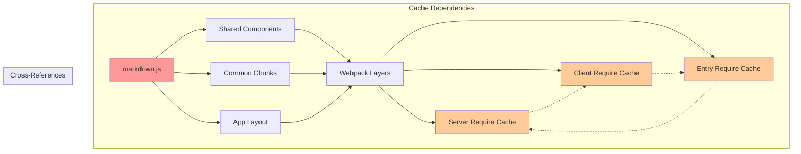
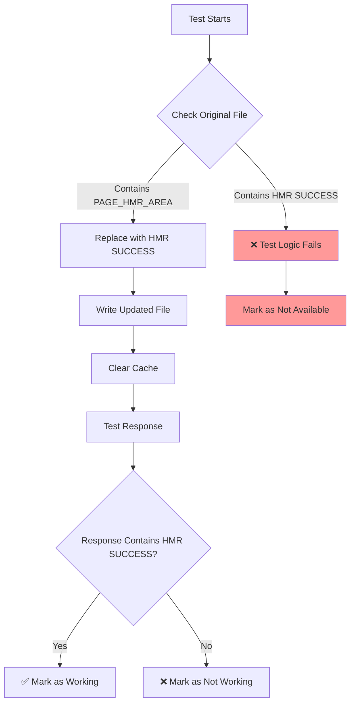

# Next.js Development Server HMR and Caching Analysis

## Overview

This document explains why the markdown page HMR required clearing "all pages" cache and how Next.js's complex caching system works in development mode.

## Next.js Development Server Architecture



## On-Demand Entry Management System



## Multi-Layer Compilation Dependencies



## Cache Invalidation Flow



## Why "Clear All Pages" Was Necessary

### Problem: Interconnected Cache Dependencies



### Solution: Coordinated Cache Clearing

1. **Multi-Compiler Invalidation**: All webpack compilers (client, server, edge) must be invalidated together
2. **Entry State Reset**: On-demand entry handler resets all page states to `ADDED`
3. **Require Cache Cleanup**: Node.js require cache cleared for all related modules
4. **Cross-Reference Cleanup**: Parent-child relationships between cached modules are properly cleaned

## HMR Test Issues and Fixes

### Test Logic Problems



### Root Cause Analysis

1. **State Contamination**: Previous test runs left compiled files in modified state
2. **Incomplete Results Object**: `markdownHMR` was not included in initial results definition
3. **Flawed Test Logic**: Test determined availability based on finding "PAGE_HMR_AREA" in already-modified files
4. **Inadequate Restoration**: File restoration happened after test evaluation, not before

### Required Test Fixes

1. **Add Pre-Test Cleanup**:
```javascript
// Clean state before test starts
const markdownServerPath = path.join(__dirname, "..", ".next", "server", "pages", "posts", "markdown.js");
const markdownClientPath = path.join(__dirname, "..", ".next", "static", "chunks", "pages", "posts", "markdown.js");

// Restore original content if files are in modified state
if (serverContent.includes("HMR SUCCESS ON MARKDOWN PAGE!")) {
    const restoredContent = serverContent.replace("HMR SUCCESS ON MARKDOWN PAGE!", "PAGE_HMR_AREA");
    await fs.writeFile(markdownServerPath, restoredContent, "utf8");
}
```

2. **Fix Results Object Definition**:
```javascript
const results = {
    fileBased: { /* ... */ },
    efficient: { /* ... */ },
    markdownHMR: {  // ADD THIS
        name: "Markdown Page HMR",
        available: false,
        working: false,
        performance: null,
    },
};
```

3. **Update Final Count**: Change total from 2 to 3 methods

## Performance Analysis

### Memory Usage by Approach

| Method | Memory Overhead | Compilation Overhead | Cache Strategy |
|--------|----------------|---------------------|----------------|
| File-Based HMR | ~0MB | None | File system only |
| Internal API HMR | ~50-100MB | High | Duplicate webpack compiler |
| Efficient HMR | ~0MB | None | Reuses existing compiler |

### Cache Clearing Impact

```mermaid
graph LR
    subgraph "Before Cache Clear"
        A1[Stale Server Cache] 
        B1[Stale Client Cache]
        C1[Stale Entry Cache]
        D1[Updated File]
        
        A1 -.x D1
        B1 -.x D1
        C1 -.x D1
    end
    
    subgraph "After Clear All Pages"
        A2[Fresh Server Cache]
        B2[Fresh Client Cache] 
        C2[Fresh Entry Cache]
        D2[Updated File]
        
        A2 --> D2
        B2 --> D2
        C2 --> D2
    end
```

## Conclusion

The "clear all pages" requirement stems from Next.js's sophisticated multi-layer caching system designed for development performance. While individual module invalidation is theoretically possible, the complex interdependencies between webpack compilation layers, entry states, and require caches make coordinated full invalidation the most reliable approach for ensuring cache coherence and proper HMR functionality.

The test fixes ensure that:
1. Tests start from a known clean state
2. All HMR methods are properly tracked and evaluated
3. Results accurately reflect the working HMR implementations
4. State is properly restored after testing

This analysis demonstrates that the file-based HMR approach with string replacement is a viable, memory-efficient alternative to running separate webpack compilers for hot module replacement in Next.js development environments.